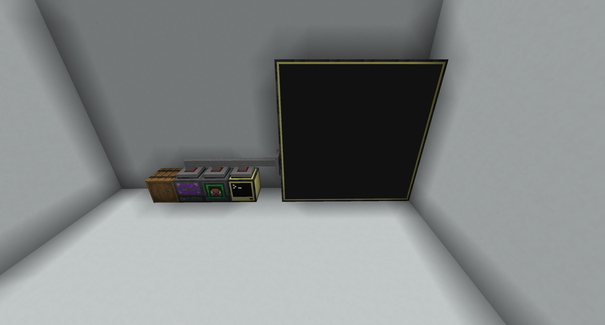

Computercraft scripts im doing to help with a Colony on ATM10

I'm re-learning lua and the scripts are of questionable quality

It seems to work perfeclty fine on the server I am running.

To make it work make sure you have something like the follolwing setup:
* ME bridge
* Storage next to the ME bridge
* Player detector
* Advanced computer
* Avanced monitor (Make large)

All connected with wired routers.

# Todo:
- [ ] Needs screen cold use different views (Complete list, group by citizen, etc)
- [ ] ~~I think the count of items needed is wrong~~ Item count fixed
- [ ] Better settings
- [ ] Refined Storage Option
